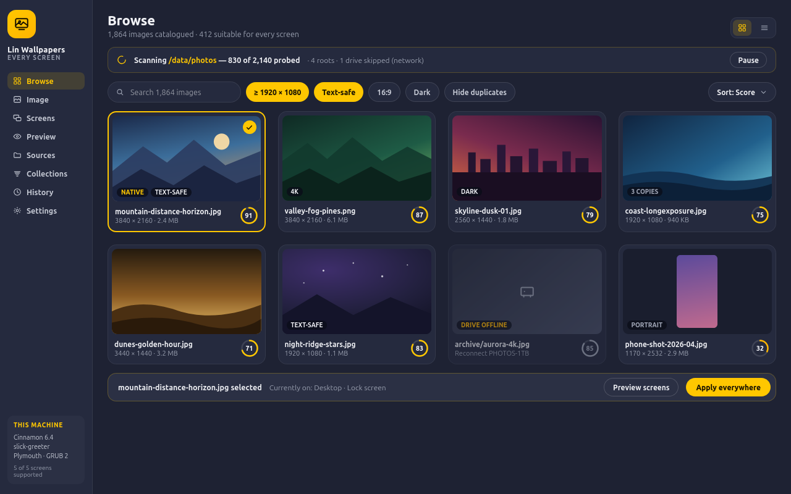

# Lin Wallpapers

**One wallpaper, every screen.**
Lin Wallpapers finds the images already on your machine, catalogues them into a fast browser, and applies
the one you pick to your **desktop, lock screen, login screen, boot splash and boot menu** — with a preview
of each screen before anything changes, and one-click undo after.

> **Status: M0 (Foundation) in progress.** The app shell opens, navigates and is themed; the `linwp` CLI, the
> provider registry, the layering rules and the test harness are in place. No features yet — scanning starts
> at **M1** ([docs/milestones.md](docs/milestones.md)). Everything below describes the target of v1.0.
>
> **Lin Wallpapers is not a service.** It is a window you open to change a wallpaper; it writes ordinary OS
> configuration and exits. No daemon, nothing enabled at boot — the desktop, greeter, Plymouth and GRUB keep
> displaying the result on their own, even if you uninstall the app.

| | |
| --- | --- |
| Platforms | Any Debian-based distribution with GTK 3 — Mint, Ubuntu and its flavours, Debian 12+, Pop!_OS, Zorin, MX, elementary. The desktop, greeter, boot splash and boot manager are **detected, never assumed** |
| Stack | Python 3.12 · GTK 3 (PyGObject), written to port to GTK 4 · Cairo · GdkPixbuf/Pillow · SQLite · a one-shot polkit helper |
| Based on | [gtk-python-dashboard-starter](https://github.com/mikesdatawork/gtk-python-dashboard-starter) (app shell) · [`reference/apply-08-screen-wallpaper.sh`](reference/README.md) (the working base script the apply engine is built around) |
| Standards | [MensuraMedia/universal-instruction-set](https://github.com/MensuraMedia/universal-instruction-set) v2026.04 |
| Design reference | `universal-themes/image-reference/ui-kit-yellow-gray-yello.jpg` (dark navy-gray, one yellow accent) |
| License | Free to use, modify and distribute. **Commercial use requires prior written permission.** ([LICENSE](LICENSE), [NOTICE](NOTICE)) |



*Mockup: the Browse page. More screens — image detail, the five surfaces with what was detected, the
all-screens preview and the apply plan — in [docs/mockups/](docs/mockups/).*

---

## Contents
1. [Why this exists](#1-why-this-exists)
2. [What it does](#2-what-it-does)
3. [The five screens](#3-the-five-screens)
3a. [Every Debian-based distro](#3a-every-debian-based-distro)
3b. [The base script](#3b-the-base-script)
4. [Using the app](#4-using-the-app)
5. [The technology stack](#5-the-technology-stack)
6. [Architecture and modularity](#6-architecture-and-modularity)
7. [Design language](#7-design-language)
8. [Safety and security](#8-safety-and-security)
9. [Installation](#9-installation)
10. [Command line](#10-command-line)
11. [Development](#11-development)
11a. [Engineering practices](#11a-engineering-practices-what-holds-and-what-does-not-yet)
12. [Project layout](#12-project-layout)
13. [Roadmap](#13-roadmap)
14. [Documentation](#14-documentation)
15. [License and credits](#15-license-and-credits)

---

## 1. Why this exists

Changing the desktop wallpaper is easy. Making the *whole machine* match it is not:

| Screen | What it actually takes by hand |
| --- | --- |
| Desktop | a settings panel — fine |
| Lock screen | usually follows the desktop, unless it doesn't |
| Login screen | root: copy the image somewhere the greeter user can read (your home folder is mode 750), then edit the greeter config |
| Boot splash | root: write a Plymouth theme, register it with `update-alternatives`, rebuild the initramfs for every kernel |
| Boot menu | root: convert the image to something GRUB can decode, add a `/etc/default/grub.d` drop-in, run `update-grub` |

That procedure was written and run by hand on an ASUS TUF F15 (Linux Mint 22.2) — it works, it is in this
repository as [`reference/apply-08-screen-wallpaper.sh`](reference/README.md), and it is far too much work
to repeat for the next wallpaper, let alone on another machine or another distribution. Lin Wallpapers
turns that script into an application: discovery, a catalogue, real previews, a transactional apply and an
undo — and providers that make the same steps work beyond Mint.

## 2. What it does

| Area | Functionality |
| --- | --- |
| **Discover** | Scans home folders, XDG picture directories, system wallpaper directories, extra partitions and external drives. Incremental rescans skip unchanged files; new drives offer themselves. |
| **Exclude** | You decide what the search skips: a **folder**, a single **file**, a **pattern** (`**/thumbs/**`, `IMG_E*.jpg`), or a named **group** of any of those switched on and off as one. Network mounts, caches, snapshots, game libraries and build trees are built-in groups — visible, explainable, and yours to switch off. Excluding never deletes anything and undoes instantly; every skip is counted against the rule that caused it. |
| **Measure** | Every scan first reads **this desktop's own display dimensions** — each connected monitor in physical pixels, rotation and HiDPI scaling accounted for (GDK in the app, DRM sysfs for `linwp`, or a display you declare). That measurement is what "suitable" is judged against, and it is stored with the scan. |
| **Ideal images** | Images whose dimensions fit your screen — large enough to need no upscaling, close enough in shape to crop cleanly (≤ 16 % lost), right orientation — are gathered automatically into **Ideal for this desktop**, with sub-segments per monitor, *exact match*, *larger than needed* and *near misses*. It fills during the first scan, regroups in under a second when you dock or change monitor, and every image says why it is in or out. |
| **Catalogue** | A local SQLite index: resolution, aspect, format, dominant palette, perceptual hash, duplicates, badges and a suitability score, with a thumbnail cache. Rebuildable at any time; an unplugged drive dims its images instead of losing them. |
| **Judge** | A transparent 0–100 suitability score — resolution against your actual displays, aspect match, detail distribution (is there a calm area for the login prompt?), color coherence, format integrity, and penalties for icons, sprites and tiny images. Every badge explains itself. |
| **Browse** | A virtualized grid that stays smooth at tens of thousands of images: search, filter by resolution/aspect/orientation/color/text-safe/duplicates/source, sort, tag, collect, and smart collections from saved filters. |
| **Preview** | See the image *as each screen* before applying: desktop with panel and icons, lock screen with clock, login screen with the greeter's fields, boot splash rendered with the real theme geometry, and the boot menu over the quantized image. Optionally run the real splash for 8 seconds on the framebuffer. |
| **Apply** | To one screen or to all five. You see the exact step list first. Every apply backs up what was there, verifies the result (including that the theme really is inside the new initramfs) and rolls back on failure. |
| **Undo** | Full history of applies with thumbnails and results; undo restores every file and setting from the backup manifest. |
| **Sync** | Optional and off by default: keep all screens matching the desktop wallpaper automatically. It is the only part that keeps running — a session autostart entry, not a service — and switching it off leaves every screen as it is. |
| **Explain** | Whatever your system can't do stays in the app, greyed out and labelled *"Unsupported in {your distribution}"*, with a plain reason, the evidence behind it and what would change it. An activity log records every such decision, and one button copies a diagnostics bundle. |
| **Script** | The `linwp` CLI does everything the GUI does, for automation and headless use. |

## 3. The five screens

| Screen | How it's set | Needs root | Takes effect |
| --- | --- | --- | --- |
| **Desktop** | Desktop settings (`org.cinnamon.desktop.background` and equivalents), per monitor where supported | no | instantly |
| **Lock screen** | Follows the desktop, or an explicit override | no | next lock |
| **Login screen** | Image copied to a system path + greeter configuration (slick-greeter first) | yes | next logout |
| **Boot splash** | Generated Plymouth theme + `update-alternatives` + initramfs rebuild | yes | next boot |
| **Boot menu** | GRUB-safe PNG + `/etc/default/grub.d` drop-in + `update-grub` | yes | next boot |

Each screen is probed at runtime. If your machine can't do one of them — no Plymouth, a read-only `/boot`,
GDM under Wayland — the app says so, names the component that owns it, and disables that tile instead of
failing halfway through an apply.

## 3a. Every Debian-based distro

Nothing in the mechanism is Mint-specific; only the *names* and the *assumptions* were. Both are replaced by
runtime detection, so the same build works across the family. What gets detected, and what it selects:

| Your machine has | Lin Wallpapers uses | Typically |
| --- | --- | --- |
| Cinnamon · GNOME · MATE · Xfce · Plasma | that desktop's own background mechanism (GSettings, `xfconf`, `plasma-apply-wallpaperimage`) | Mint · Ubuntu/Debian/Pop!_OS/Zorin · Ubuntu MATE · Xubuntu/MX · Kubuntu |
| slick-greeter · lightdm-gtk-greeter · SDDM · GDM3 | that greeter's own configuration (drop-in or config key; GDM through its documented, reversible override) | Mint · Xubuntu/MX/Debian Xfce · Kubuntu/Lubuntu · Ubuntu/Debian GNOME |
| Plymouth with initramfs-tools · with dracut | a generated script theme + `update-alternatives`, then `update-initramfs -u -k all` or `dracut --regenerate-all` | all of them |
| GRUB 2 · no GRUB | a `/etc/default/grub.d` drop-in + `update-grub`/`grub-mkconfig`, or the surface reported unsupported with the reason | all of them · some EFI installs |

Distribution-specific details are resolved the same way: the spinner frames for the generated boot theme are
taken from whichever Plymouth theme is currently selected (`mint-logo`, `bgrt`, `spinner`, …), the boot-menu
command and the `grub.cfg` location are detected, and the initramfs generator is whichever one owns
`/boot/initrd.img-*`. No code branches on a distribution name — full matrix in
[TECHNICAL-CONCEPT.md §4.2](TECHNICAL-CONCEPT.md).

`linwp doctor` prints exactly what was detected on your machine, and why any screen is unavailable.

## 3b. The base script

[`reference/apply-08-screen-wallpaper.sh`](reference/README.md) is the working script that already does the
three privileged screens on a real machine — and it *is* the engine. Each of its steps maps to a module:
reading the current wallpaper from the desktop settings, the zoom/center-crop render, copying the image to a
greeter-readable system path and editing the greeter config, generating the Plymouth theme and rebuilding
the initramfs, writing the GRUB drop-in and regenerating the menu, backing up before each write, and the
complete `--undo`. The app adds the catalogue, previews, verification and history around those steps; it
does not replace them. Mapping table: [`reference/README.md`](reference/README.md).

## 4. Using the app

1. **First run** — Lin Wallpapers proposes scan locations (your Pictures folder, system wallpapers, mounted
   partitions). Nothing is scanned until you say go.
2. **Browse** — the scan measures your display first ("eDP-1 · 1920 × 1080"), then the grid fills as it runs
   and **Ideal for this desktop** collects the images whose dimensions fit that screen. Add `text-safe` if
   you want candidates that work on every screen.
   Don't want something searched? Right-click → *Exclude this image* or *Exclude this folder*, or manage
   folders, patterns and groups under Sources → Exclusions.
3. **Pick** — open an image for the large preview, metadata, palette and fit mode (fill / fit / center /
   stretch, with a drag-to-position focal point).
4. **Preview the screens** — the five surface previews are built from the same transform that will be
   installed, so the crop you see is the crop you get.
5. **Apply** — choose one screen or *Apply everywhere*. The sheet shows the exact steps and warns that the
   boot splash rebuilds the initramfs (about 20 seconds). Authorize once; progress is per step.
6. **Check** — desktop and lock screen change immediately; log out for the login screen; reboot for the
   splash and boot menu. If anything looks wrong, **Undo** puts it all back.

## 5. The technology stack

**Legend:** ✅ in the codebase now (M0) · ⏳ specified, arrives with the milestone shown. Versions are the ones
the app is developed and tested against (Linux Mint 22.3 / Ubuntu 24.04 base); minimums are in brackets.

### 5.1 Runtime

| Layer | Technology | Version | Status | Where / why |
| --- | --- | --- | --- | --- |
| Language | **Python** | 3.12.3 (≥ 3.11) | ✅ | Native on Debian/Mint; `from __future__ import annotations`, full type hints, `dataclasses`, `Protocol`, `enum` |
| UI toolkit | **GTK 3** via **PyGObject** (`gi.repository.Gtk`, `Gdk`) | GTK 3.24.41 · PyGObject 3.48.2 | ✅ | Native widgets; chosen in exactly one module, `src/gtk_version.py` (`LWP_GTK=4.0` selects GTK 4 from M8) |
| Platform libraries | **GLib / GObject / Gio** | 2.80 | ✅ | `Gtk.Application` (single instance), `Gio.SimpleAction` + accelerators, `GObject` signals, `GLib.idle_add`, `Gio.Settings`, `Gio.Resource` |
| Text | **Pango** | 1.52 | ✅ | Label layout and wrapping through GTK |
| Drawing | **Cairo** via **pycairo** | cairo 1.18 · pycairo 1.25.1 | ✅ | The logo mark today (`compat.CanvasArea`); the five screen previews, score rings and crop overlay from M2–M3 |
| Styling | **GTK CSS** with `@define-color` design tokens | — | ✅ | `resources/css/tokens.css` is the only file with color values; `style.css` holds component classes |
| Resource bundle | **GResource** (`glib-compile-resources`) | 2.80 | ✅ | CSS compiled into `build/lin-wallpapers.gresource`; falls back to `resources/` when not built |
| Settings | **GSettings / dconf** (`glib-compile-schemas`) | 2.80 | ✅ | Window size and last route (`data/*.gschema.xml`); the desktop/lock wallpaper keys from M4 |
| Concurrency | `concurrent.futures.ThreadPoolExecutor` → `GLib.idle_add` | stdlib | ✅ | One pattern, `src/util/threads.py`; workers never touch widgets; pool shut down on exit |
| CLI | `argparse`, `json` | stdlib | ✅ | `linwp` — full argument surface, `--json`, documented exit codes; imports no GTK |
| Images | **GdkPixbuf** (loading, thumbnails) + **Pillow** (transforms, EXIF/ICC, quantization) | 2.42.10 · 10.2.0 | ⏳ M1 / M3 | Same Pillow math as the base script's `render()` |
| Storage | **SQLite** (`sqlite3`, WAL) · freedesktop-style thumbnail cache · JSON plans and manifests | 3.45.1 | ⏳ M1 / M4 | One portable, rebuildable file; no server |
| System access | **D-Bus** via `Gio.DBusProxy` (udisks2, logind) · `findmnt` · `xdg-user-dir` · `Gdk.Monitor` | — | ⏳ M1–M3 | Standard interfaces, no distro sniffing |
| Desktop back ends | GSettings schemas (Cinnamon, GNOME, MATE) · `xfconf-query` · `plasma-apply-wallpaperimage` | — | ⏳ M4 | One provider module each |
| Privileged actions | One-shot helper in `/usr/libexec/` through **polkit** `pkexec` — no daemon, no service unit | — | ⏳ M5 | The GUI never runs as root, and nothing is left running |
| Boot-facing tools | `plymouth`, `update-alternatives`, `update-initramfs` / `dracut`, `update-grub` / `grub-mkconfig` — argument vectors, never a shell | — | ⏳ M5–M6 | The only way to change splash and menu, done safely |
| Reference engine | **Bash** + Plymouth script + GRUB drop-in (`reference/`) | bash 5.2 | ✅ (reference) | The working base script the apply providers reproduce |

### 5.2 Build, quality and tooling

| Purpose | Tool | Version | Status | Notes |
| --- | --- | --- | --- | --- |
| Packaging metadata | **setuptools** (PEP 517/621 `pyproject.toml`), editable install | 68.1 | ✅ | Console script `linwp`, GUI script `lin-wallpapers`; version from `src.__version__` |
| Environment | `python3 -m venv --system-site-packages` | — | ✅ | PyGObject, pycairo and Pillow come from **apt**, never PyPI; the venv adds only this package and dev tools |
| Bootstrap / launch | `run.sh` (**Bash**, `set -euo pipefail`) | bash 5.2 | ✅ | venv → GResource → schema → launch; `--setup`, `--dev` |
| Task runner | **GNU Make** | 4.3 | ✅ | `make check` is the single build-test path |
| Lint + format | **ruff** (`E,F,W,I,B,UP,SIM,PTH,RUF`) | 0.16.8 | ✅ | 110 columns; Markdown excluded from formatting |
| Types | **mypy** — strict on `src/apply`, `src/catalogue`, `src/imaging`, `src/helper` | 2.3.1 | ✅ | 45 source files, 0 issues |
| Architecture rules | **import-linter** | 2.15 | ✅ | Widgets never reach services · services never import `gi` · the registry never imports a provider |
| GTK 4 portability | `tools/gtk4_lint.py` (stdlib `ast`) | — | ✅ | Fails on GTK 3-only calls outside `src/ui/compat.py` and on any second version gate |
| Tests | **pytest** + **pytest-cov** (coverage.py 7.13) | 9.0.2 · 7.0.0 | ✅ | 34 unit tests (no display) + 6 smoke tests that launch the real app under `G_DEBUG=fatal-criticals` |
| Headless display | `xvfb-run` when installed, else the session display | — | ✅ | `sudo apt install xvfb` for CI-style runs |
| Shell lint | **shellcheck** (via `shellcheck-py`) | 0.11.0 | ✅ | `run.sh` is clean |
| Fake roots | `tests/fakeroot/` + the `fakeroot` fixture | — | ✅ skeleton | Synthetic `/etc`, `/usr/share`, `/boot`; providers are tested there from M3 |
| Mockups | Design Component HTML + headless **Firefox** renderer (`docs/mockups/render.py`) | — | ✅ | Reproducible screenshots in `docs/mockups/png/` |
| Distribution | `debhelper` + `dh-python` `.deb`, `.desktop`, AppStream metainfo, polkit actions, man pages, `lintian` | — | ⏳ M6 | No service units; nothing enabled at install |
| i18n | `gettext` | — | ⏳ M7 | The reason-code catalogue is the extraction point |
| Standards | [universal-instruction-set](https://github.com/MensuraMedia/universal-instruction-set) v2026.04 | — | ✅ `CLAUDE.md` · ⏳ `.claude/` scaffold | See [docs/milestones.md](docs/milestones.md), "M0 status and deviations" |

**Runtime system packages:**
`python3-gi gir1.2-gtk-3.0 gir1.2-gdkpixbuf-2.0 python3-gi-cairo python3-pil libglib2.0-bin polkitd pkexec dbus`
**Build-time:** `libglib2.0-dev-bin` (`glib-compile-resources`) · **Recommended:** `plymouth grub2-common udisks2` ·
**Development:** `requirements-dev.txt`, optionally `xvfb shellcheck`

**Why GTK 3 today, GTK 4 tomorrow:** the starter template and Mint 22's default session are GTK 3, so v1
ships there. The GTK version is chosen in exactly one module, pages use a small compatibility layer instead
of GTK 3-only calls, custom drawing goes through one canvas wrapper, and the build fails on banned APIs — so
the GTK 4 port (M8) is mechanical rather than a rewrite.

## 6. Architecture and modularity

```
UI (pages, components)  →  view models  →  services  →  providers  →  system
        GTK only              no GTK          no GTK      one per backend
```

- **Providers, not conditionals.** Each screen, desktop environment, greeter, splash system, boot manager,
  scan source, scorer and imaging backend is a module behind a stable interface, chosen by a runtime
  capability probe. Supporting Xfce, SDDM or dracut means adding a file, not editing the core. A broken
  provider degrades one tile, not the app. **No code branches on a distribution name** — that rule is in the
  review checklist, along with "every new provider ships detection evidence, capabilities,
  plan/apply/verify/revert, a preview spec and a fake-root golden test".
- **Layer discipline.** Services never import GTK; widgets never touch the filesystem. This is what makes
  the CLI, the tests and the GTK 4 port possible.
- **Everything is a plan.** An apply is data (ordered steps, payload hashes, backups) before it is an
  action — which is why it can be shown, tested against a fake root, executed by the CLI and rolled back.
- **The helper is small on purpose.** Six methods, no path arguments, no shell, allow-listed destinations.

Details: [TECHNICAL-CONCEPT.md §3, §13, §17](TECHNICAL-CONCEPT.md).

## 7. Design language

Dark navy-charcoal surfaces, neutral gray text, a single saturated yellow accent — from
`ui-kit-yellow-gray-yello.jpg` in the universal theme reference.

| Token | Value |
| --- | --- |
| Window / surface / raised | `#1E2233` / `#252A3E` / `#2B3044` |
| Text / dim text | `#F2F3F7` / `#8A8E9E` |
| Accent / accent-2 / on-accent | `#FFC700` / `#FFB500` / `#1A1400` |
| OK / warning / danger | `#4ADE80` / `#FFB500` / `#EF4444` |

The chrome stays neutral because **the wallpaper is the color**. Mockups: [docs/mockups/](docs/mockups/).

## 8. Safety and security

- **Nothing is overwritten without a backup.** Every apply writes a manifest (paths, modes, hashes, previous
  settings and the previous Plymouth alternative) to `/var/backups/lin-wallpapers/<timestamp>/`.
- **Verified, then committed.** The greeter config must parse and point at a readable file; the Plymouth
  theme must appear inside the rebuilt initramfs of every installed kernel; `grub.cfg` must be regenerated.
  A failed check rolls back automatically.
- **Package conffiles are never edited** (`/etc/default/grub`, `lightdm.conf`) — drop-ins only, so package
  upgrades stay silent.
- **Atomic writes:** temp file in the destination filesystem → `fsync` → `rename`.
- **Nothing runs in the background.** Lin Wallpapers is a window, not a service: no daemon, no unit enabled
  at boot, no tray agent. It writes ordinary OS configuration and gets out of the way — the desktop, greeter,
  Plymouth and GRUB display the result on their own, and they keep it even if you uninstall the app. The
  privileged helper runs for the seconds an apply takes (via `pkexec`) and exits; the only long-running piece
  is sync mode, which is opt-in, off by default, and a session autostart entry you can switch off.
- **The helper** accepts no destination paths, re-hashes and re-renders anything the GUI sends, calls
  binaries with argument vectors and never a shell, and authorizes once per apply through polkit.
- **Boot escape hatch:** if a splash ever misbehaves, remove `splash` from the kernel line in the GRUB menu
  for one boot, then `linwp undo`.

## 9. Installation

*(from M6; until then, run from source — §11)*

```bash
sudo apt install ./lin-wallpapers_<version>_all.deb ./lin-wallpapers-helper_<version>_all.deb
lin-wallpapers        # nothing is enabled or started at install time
```

## 10. Command line

```bash
linwp scan                          # scan the configured roots
linwp scan --add /media/user/photos # add a root and scan it
linwp scan --display 3840x2160      # also judge for a display that isn't connected
linwp displays                      # the screen dimensions the scan measured, and from where
linwp exclude add ~/Pictures/scans  # exclude a folder (or a file, or a glob: '**/thumbs/**')
linwp exclude add '*.screenshot.png' --group "Work documents"
linwp exclude group disable "Game libraries"
linwp exclude test /data/photos/a.jpg   # would this be scanned? if not, which rule says no?
linwp exclude list
linwp list --ideal                  # images whose dimensions suit this desktop
linwp list --ideal --display HDMI-A-1
linwp list --near-miss              # almost fit, and why not
linwp list --min-width 1920 --text-safe --sort score --limit 20
linwp show <id|path>                # metadata, score, badges, where it's currently applied
linwp preview <id|path> --surface splash --out /tmp/splash.png
linwp apply <id|path> --surface all --mode fill        # prompts through polkit
linwp apply <id|path> --surface desktop,lock
linwp plan  <id|path> --surface all                    # print the plan, change nothing
linwp undo                          # revert the last apply
linwp history
linwp sync --enable
linwp doctor                        # capability probe: what this machine supports, and why not
```

`--json` on any command for machine-readable output; exit codes distinguish "refused authorization",
"unsupported surface" and "failed and rolled back".

## 11. Development

```bash
git clone git@github.com:MensuraMedia/lin-wallpapers.git
cd lin-wallpapers
sudo apt install python3-gi gir1.2-gtk-3.0 gir1.2-gdkpixbuf-2.0 python3-gi-cairo python3-pil
sudo apt install xvfb shellcheck     # optional: headless smoke test, system shellcheck
./run.sh                 # creates .venv (system site packages), builds resources + schema, launches the app
./run.sh --dev           # the same, plus the dev tools from requirements-dev.txt; does not launch

make check               # the whole pipeline: shellcheck → ruff → mypy → gtk4_lint → import-linter → pytest → smoke
.venv/bin/python -m pytest -m "not smoke"   # unit tests only (no display needed)
make smoke               # launches the real app and walks every route (xvfb-run when installed)
.venv/bin/linwp --version
LWP_GTK=4.0 ./run.sh     # (from M8) the GTK 4 build
```

PyGObject, pycairo and Pillow come from the distribution, never from PyPI — the venv only adds the package
itself (`linwp`) and the dev tools.

Tests never touch the real system: provider tests run against `tests/fakeroot/`, a synthetic `/etc`,
`/usr/share` and `/boot`, and assert both the applied tree and the rolled-back tree.

## 11a. Engineering practices: what holds, and what does not yet

An audit of the M0 codebase against common practice for a Python/GTK desktop application.

| Practice | State | Evidence |
| --- | --- | --- |
| Layered architecture, enforced by tooling rather than by review | ✅ | `import-linter` contracts in `pyproject.toml`; `make check` fails when one breaks |
| UI never blocks; one threading pattern | ✅ | `src/util/threads.py`; the pool is shut down in `do_shutdown` |
| `Gtk.Application`, actions and accelerators instead of `Gtk.main()` and ad-hoc key handlers | ✅ | `src/main.py`; single instance verified by launching twice |
| Forward compatibility (GTK 4) designed in, and checked | ✅ | one version gate, `ui/compat.py`, `tools/gtk4_lint.py` (AST-based, tested against a bad sample) |
| Design tokens as the single source of color | ✅ | `tokens.css`; tests fail on any hex/`rgb()` in `style.css` or in Python |
| Static typing | ✅ / partial | mypy clean; strict on the engine layers. GTK widgets are typed `Any` — PyGObject ships no stubs |
| Lint, format, shell lint | ✅ | ruff, `shellcheck`, `bash -n` |
| Tests that exercise the real app, not only units | ✅ | smoke test walks all routes under `G_DEBUG=fatal-criticals` and asserts nothing is left running |
| Tests never touch the real system | ✅ | `tests/fakeroot/` + fixture; M0 writes nothing outside `$HOME` |
| Standard packaging metadata (PEP 517/621), console scripts | ✅ | `pyproject.toml` |
| System libraries from the distribution, not rebuilt from PyPI | ✅ | venv with `--system-site-packages` |
| XDG base directories, GSettings for preferences | ✅ | `config_paths.py`, `window_state.py` |
| Least privilege; no background processes | ✅ | nothing privileged exists yet; the smoke test asserts a clean exit |
| Docs, changelog and decision record kept with the code | ✅ | README, concept, milestones ("M0 status and deviations"), `changelog.md` |
| **Importable package named `src`** | ⚠️ deviation | Installing a top-level package called `src` is an anti-pattern (name collisions in site-packages). Chosen because the spec's acceptance check imports `src.gtk_version`. Fix before packaging (M6): rename to `lin_wallpapers/` under a `src/` layout |
| **Continuous integration** | ❌ missing | `make check` is CI-ready but no workflow runs it; needs `xvfb` |
| **Pinned development tools** | ❌ missing | `requirements-dev.txt` has lower bounds only — no lock file, so tool upgrades can change lint results |
| **Coverage of GTK code is not measured** | ⚠️ | unit coverage reports 34 % because the UI runs in smoke-test subprocesses; no coverage threshold is enforced |
| **Headless test display** | ⚠️ | without `xvfb` the smoke test opens windows on the developer's desktop |
| **Accessibility** | ⚠️ partial | focus-visible styling and keyboard routes exist; AT-SPI labels on custom-drawn widgets start with the first real components (M1) |
| **Desktop integration files** | ⏳ M6 | no `.desktop`, icon or AppStream metadata yet, so the window has a generic icon |
| **Universal `.claude/` scaffold** | ❌ open (M0.1) | must be deployed by hand; see [docs/milestones.md](docs/milestones.md) |
| **Version control hygiene** | ⚠️ | the M0 work is not committed yet |

## 12. Project layout

As of M0. Generated with `tree`; build outputs (`.venv/`, `build/`, caches) are git-ignored and omitted.
Packages marked *(skeleton)* hold only a documented `__init__.py` until their milestone.

```
lin-wallpapers/
├── README.md                      # this file
├── TECHNICAL-CONCEPT.md           # architecture and design decisions
├── CLAUDE.md                      # build/test/lint commands and conventions (universal template v2026.04)
├── changelog.md                   # append-only local change log
├── LICENSE · NOTICE               # license, third-party notices
├── pyproject.toml                 # packaging + ruff, mypy, pytest, coverage, import-linter config
├── requirements.txt               # (runtime deps come from apt — documented here)
├── requirements-dev.txt           # ruff, mypy, pytest, pytest-cov, import-linter, shellcheck-py
├── run.sh*                        # venv + GResource + schema + launch
├── Makefile                       # make check | smoke | run | clean
├── .gitignore · .claudeignore
│
├── src/                           # the application package
│   ├── __init__.py                # __version__, APP_ID, APP_NAME
│   ├── main.py                    # Gtk.Application entry point (single instance, actions, accelerators)
│   ├── gtk_version.py             # THE one place GTK 3/4 is chosen
│   ├── config/                    # no GTK
│   │   ├── config_layout.py       #   window/sidebar sizes, 8 px grid, 12/16 px radii
│   │   ├── config_paths.py        #   project, build and XDG data/cache/state paths
│   │   ├── config_theme.py        #   token names, load_tokens(), fonts
│   │   └── config_themes.py       #   theme registry (token-override files, no colors in Python)
│   ├── ui/                        # GTK only
│   │   ├── compat.py              #   GTK 3↔4 layer: append, set_child, show, CanvasArea, gestures, …
│   │   ├── dashboard_window.py    #   ApplicationWindow: sidebar + content, win.navigate action
│   │   ├── sidebar.py             #   logo mark (Cairo), NAV_ITEMS, "this machine" footer slot
│   │   ├── content_area.py        #   Gtk.Stack of pages, one scroll state each
│   │   ├── window_state.py        #   size + last route in GSettings
│   │   └── components/            #   (skeleton) image card, filter bar, surface tile … from M1
│   ├── modules/                   # starter-template managers
│   │   ├── manager_navigation.py  #   route table and page switching
│   │   └── manager_theme_applicator.py  # loads tokens.css + style.css (GResource or files)
│   ├── pages/                     # one BasePage subclass per route
│   │   ├── page_base.py           #   titles, paragraphs, the milestone placeholder card
│   │   ├── page_browse.py · page_image.py · page_screens.py · page_preview.py
│   │   ├── page_sources.py · page_collections.py · page_history.py · page_settings.py
│   │   └── page_about.py          #   opened from Settings
│   ├── viewmodels/                # (skeleton, M1) observable state between services and widgets
│   ├── scanner/                   # (skeleton, M1–M2) roots, walk, probe, score, hash     — no gi
│   ├── catalogue/                 # (skeleton, M1) SQLite index, queries, thumbnails      — no gi
│   ├── imaging/                   # (skeleton, M3) the one transform pipeline             — no gi
│   ├── preview/                   # (skeleton, M3) Cairo compositor                       — no gi
│   │   └── surfaces/              #   one mock per screen
│   ├── apply/                     # apply engine                                          — no gi
│   │   ├── registry.py            #   SurfaceProvider Protocol, data types, ProviderRegistry
│   │   └── providers/             #   (skeleton, M3–M7) one module per desktop/greeter/splash/boot manager
│   ├── helper/                    # (skeleton, M5) the one-shot pkexec helper             — no gi
│   ├── sync/                      # (skeleton, M6) opt-in sync agent
│   ├── cli/
│   │   └── linwp.py               # the linwp command line, exit-code table
│   └── util/
│       └── threads.py             # run_in_worker() → scheduler (GLib.idle_add)
│
├── resources/
│   ├── lin-wallpapers.gresource.xml
│   ├── css/
│   │   ├── tokens.css             # the ONLY file with color values
│   │   └── style.css              # component classes (sidebar, card, chip, pill, …)
│   └── icons/                     # (empty until M6: symbolic icon set)
├── data/
│   └── io.mensuramedia.LinWallpapers.gschema.xml
├── tools/
│   └── gtk4_lint.py               # AST-based GTK 4 portability guard
│
├── tests/
│   ├── conftest.py                # the fakeroot fixture
│   ├── unit/                      # no display needed
│   │   ├── test_registry.py · test_tokens.py · test_cli.py
│   │   └── test_threads.py · test_gtk4_lint.py
│   ├── smoke/                     # launches the real app
│   │   ├── drive_app.py           #   walks every route, optional screenshot
│   │   ├── test_app_smoke.py      #   clean start/exit, nothing left running, GTK 4 gate
│   │   └── test_compat.py         #   compat helpers against real widgets
│   └── fakeroot/
│       ├── README.md
│       └── base/                  # synthetic root: etc/{lightdm,default/grub.d} · usr/share/{backgrounds,plymouth/themes} · boot/grub
│
├── reference/                     # THE BASE SCRIPT the apply engine reproduces
│   ├── README.md                  #   step → module mapping
│   ├── apply-08-screen-wallpaper.sh*
│   ├── plymouth-theme/            #   fx506li-wallpaper.plymouth · .script
│   └── grub.d/                    #   99-fx506li-background.cfg
└── docs/
    ├── milestones.md              # M0–M8 delivery plan, M0 status and deviations
    └── mockups/                   # *.dc.html artboards · canvas.json · render.py* · png/
```

Still to come: `debian/` (M6), `resources/plymouth-template/` (M5), `src/capability/` (M6), `.claude/` (M0.1,
deployed by hand).

## 13. Roadmap

| Milestone | Deliverable |
| --- | --- |
| M0 | Scaffold, app shell, theme tokens, empty pages |
| M1 | Scanner with folder/file/pattern/group exclusions, display-dimension detection, catalogue, thumbnails, the ideal-images segment, Sources + Browse |
| M2 | Scoring, badges, duplicates, Image page |
| M3 | Transform pipeline, previews, Screens page with capability probes |
| M4 | Apply engine (plan, backup, verify, rollback), History/undo; desktop + lock on Cinnamon, GNOME, MATE, Xfce, Plasma |
| M5 | One-shot `pkexec` helper, polkit actions (no service units), the base script's three privileged screens end-to-end (slick + lightdm-gtk greeters, Plymouth, GRUB), `linwp` CLI and `doctor` |
| M6 | GDM and SDDM providers, dracut back end, five distribution fake roots, sync mode, collections, slideshows, `.deb`, first release |
| M7 | Breadth: LXQt/Pantheon/Budgie, per-monitor and Wayland refinements, online sources |
| M8 | GTK 4 port |

## 14. Documentation

| Document | Contents |
| --- | --- |
| [TECHNICAL-CONCEPT.md](TECHNICAL-CONCEPT.md) | Architecture, the five surfaces, scanning, scoring, catalogue schema, previews, transforms, the apply transaction, the helper and its security model, UI concept, design tokens, modularity, GTK 4 rules, packaging, testing, roadmap, risks |
| [docs/milestones.md](docs/milestones.md) | Delivery plan M0–M8, with **M0 (Foundation)** broken down into tasks, acceptance criteria and risks |
| [reference/README.md](reference/README.md) | The base script: what each step does and which module it becomes; the rules the app inherits from it |
| [docs/mockups/](docs/mockups/) | UI mockups of the main screens, with rendered screenshots in `docs/mockups/png/` and the renderer that produces them |

## 15. License and credits

Free to use, modify and distribute; **commercial use requires prior written permission** — see
[LICENSE](LICENSE) and [NOTICE](NOTICE).

- Application shell derived from [gtk-python-dashboard-starter](https://github.com/mikesdatawork/gtk-python-dashboard-starter) by mikesdatawork.
- Visual reference: `universal-themes/image-reference/ui-kit-yellow-gray-yello.jpg` from
  [MensuraMedia/universal-instruction-set](https://github.com/MensuraMedia/universal-instruction-set).
- The base script and the five-screen procedure this app automates were first worked out by hand in
  [optimize-laptop-asus-fx50li](https://github.com/MensuraMedia/optimize-laptop-asus-fx50li) (`scripts/apply-08-screen-wallpaper.sh`).
